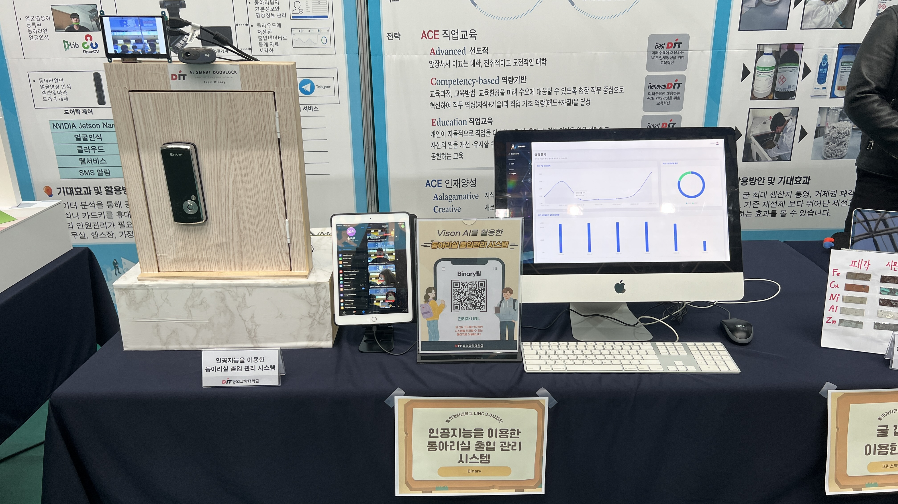
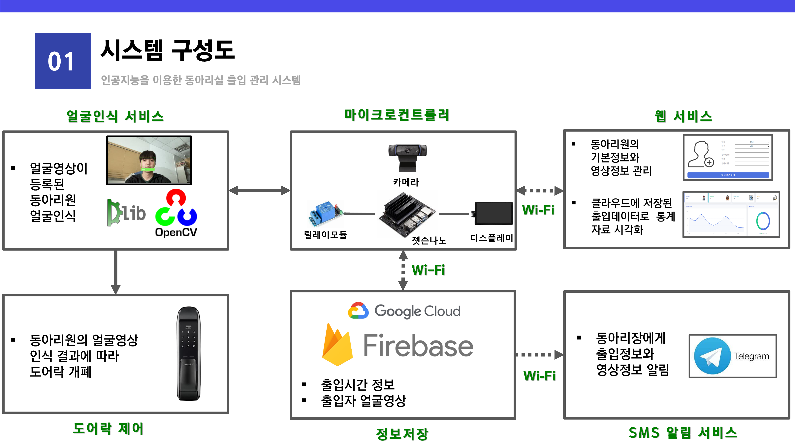

# Vision AI를 활용한 동아리실 출입 관리 시스템

## 자료

시연 영상 : https://www.youtube.com/watch?v=KznXDUn6O5U  
웹 사이트 : https://teambinary22.github.io 
통계(데이터 시각화) 웹사이트 : https://cyber-steer.github.io/capstone/web/management.html    

## 소개

Vision AI를 활용한 동아리방 출입 관리 시스템은 인공지능을 활용하여 실시간으로 이미지를 받아드린 후 저장되어 있는 안면 데이터베이스와 비교하여 사람을 자동으로 식별할 수 있는 시스템 입니다.
  
동시에 동아리방에 출입한 인원들의 데이터를 활용하여 [웹 사이트](https://cyber-steer.github.io/capstone/web/management.html)에 시각화하여 관리자, 회원이 확인할 수 있습니다. 또 관리자는 웹사이트에서 쉽게 회원을 등록, 수정, 삭제, 검색 할 수 있습니다.
  

## 주요 서비스

- 출입 통제
- SMS 알림
- 출입통계 확인
- 회원 관리

인공지능이 얼굴인식에 성공한 경우 도어락이 열리게 되며, 승인에 실패한 경우 관리자의 SMS 알림(telegram)을 전송하는 보안 기능이 있습니다. 위에서 말한 것과 같이 웹 사이트에서 출입 통계를 확인할 수 있습니다. 출입 통계는 월별, 주별로 출입 현황을 확인할 수 있으며 학년별로 출입한 횟수를 확인할 수 있습니다. 비등록 인원이 출입을 시도할 경우 해당 이미지를 캡쳐하여 웹에서 확인할 수도 있습니다.
  
## 시스템 구성도

Jetson Nano를 중심으로 도어락을 제어하는 릴레이 모듈, 이미지를 받아오는 카메라, 인공인식 현황을 확인할 수 있는 디스플레이로 구성이 되어 있습니다.
인공지능이 얼굴인식에 성공한 경우 도어락이 열리게 되며 실패한 경우 관리자의 SMS 알림이 전송되게 됩니다. 모든 데이터들은 [파이어베이스](https://firebase.google.com)에 저장되며 해당 데이터를 바탕으로 웹에서 통계를 보여줍니다.
## 주요 기술

- Jetson Nano
- Dlib
- OpenCV
- Firebase

#### 1. Jetson Nano
Jetson Nano는 NVIDIA의 소형화된 싱글보드 컴퓨터 입니다. 낮은 전력으로도 인공지능, 이미지 처리를 할 수 있는 초소형 컴퓨터 장비입니다. GPU를 탑재하고 있어 간단한 연산을 동시에 수천개 이상 처리해야 하는 딥러닝에 적합하며 외부 카메라 혹은 도어락 등과 직접 연결하는 회로 연결을 통해 컨트롤 할 수 있습니다.
 Jetson Nano는 리눅스 기반의 OS인 Jetpack을 설치하여 사용하며 GPU가속을 통한 인공지능 구축에 중요한 [CUDA](https://developer.nvidia.com/cuda-toolkit)를 사용할 수 있습니다.
#### 2. Dlib
[Dlib 라이브러리](http://dlib.net)는 이미 학습된 인공신경망 CNN 모델을 활용하여 얼굴에 랜드마크를 찍고 각 거리를 비교함으로써 얼굴을 식별할 수 있는 오픈소스입니다. 얼굴인식 과정은 만들어진 이미지 피라미드를 슬라이딩 윈도우 방식으로 탐색하는 선형분류기를 이용하여 진행합니다.
 C++기반으로 만들어 졌지만 python을 공식적으로 지원하며 [여기](http://dlib.net/cnn_face_detector.py.html)를 클릭하여 사용 예제를 확인할 수 있습니다.
<pre>
# pip을 사용하여 설치하는 방법. cmake를 설치한 환경에서 dlib을 설치할 수 있다.
pip install cmake
pip install dlib
</pre>
#### 3. OpenCV
[OpenCV](https://opencv.org)는 컴퓨터가 인간의 눈처럼 작용할 수 있도록 처리해주는 역할을 합니다. 카메라를 통해 이미지를 받아오거나 컴퓨터에 이미지를 띄우는 등의 작업을 할 수 있도록 합니다. CCTV, 로보틱스, 제품검사 등 다양한 분야에 활용됩니다.
<pre>
# pip을 사용하여 설치.
pip install opencv-python
</pre>
#### 4. Firebase
[파이어베이스](https://firebase.google.com)는 구글의 클라우드 서비스로 애플리케이션을 쉽게 제작할 수 있도록 도와주는 역할을 합니다. 파이어베이스는 데이터 분석, 회원 관리, 보안, 파일 저장 등 다양한 서비스를 제공하고 있습니다. 자신의 프로젝트에 필요한 기능을 개발자가 직접 개발하지 않고도 기능을 사용할 수 있으며 클라우드 서비스이기에 활용성도 높아집니다.
 실시간으로 웹사이트와 소통할 수 있으며 우리의 프로젝트에서는 웹 사이트와 Jetson Nano를 연결해주는 매개체 역할을 수행합니다.
 python에서 사용하기 위해서는 라이브러리를 설치 해야하며 JSON형태로 데이터를 주고 받을 수 있습니다.

## 소스 리뷰

#### 1. 프로젝트를 구현하기 위해 설치되어야 하는 라이브러리 목록
- dlib
- face_recognition
- opencv
- firebase
- numpy
- Jetson.GPIO
- telegram

모둔 러이브러리는 pip을 통해 설치할 수 있습니다.

#### 2. 얼굴인식
가장 먼저 저장소에 저장되어 있는 사람의 이미지를 불러오도록 합니다. 이미지는 ./registered 하위에 img형식으로 저장되며 읽을 수 있는 상태로 전환하도록 합니다.
<pre>
    def imgRead(self):
        self.classNames = []
        self.encoded_face_train = []
        # images = []
        mylist = os.listdir(self.path)
        for cl in mylist:
            try:
                curImg = cv2.imread(f'{self.path}/{cl}')
                curImg = cv2.cvtColor(curImg, cv2.COLOR_BGR2RGB)
                encoded_face = face_recognition.face_encodings(curImg)[0]
                self.encoded_face_train.append(encoded_face)
                self.classNames.append(os.path.splitext(cl)[0])
            except:
                print(f'error : {cl}')
</pre>

이후 얼굴 비교를 진행합니다. face_recognition 함수를 사용하여 distance를 얻을 수 있습니다. distance의 기준은 개발자가 지정할 수 있으며 0.45(tolerance) 수준이 가장 정밀하다고 보고 있습니다.
<pre>
    def getName(self, faces_in_frame, encoded_faces):
        name =''
        for encode_face, faceloc in zip(encoded_faces,faces_in_frame):
            faceDist = face_recognition.face_distance(self.encoded_face_train, encode_face)
            matchIndex = np.argmin(faceDist)

            min_faceDist = min(faceDist)
            if min_faceDist < self.tolerance:
                name = self.classNames[matchIndex]
            else:
                name = 'Unknown'
            if self.develop:
                print("name :",name)
                print("min_faceDist :",str(min_faceDist))
                name += " : "+str(min_faceDist)
        return name
</pre>

#### 3. firebase 저장
firebse에 저장하기 위해 token, id 등 필요한 요소들을 미리 입력한 후 개발자가 원하는 데이터를 저장시킬 수 있습니다. 
<pre>
    def set(self, name):
        now = datetime.datetime.now()
        date = str(now)
        data = {}

        # 깊은 복사
        data['engname'] = name
        data['number'] = self.registered_data[name]['number']
        data['name'] = self.registered_data[name]['name']
        data['time'] = date

        year = date[:4]
        month = date[5:7]
        day = date[8:10]
        if self.cooldowncheck(name):
        # if True:
            self.last_person['number'] = data['number']
            self.last_person['engname'] = name
            self.last_person['name'] = data['name']
            self.last_person['time'] = now
            self.db.child("club").child(year).child(month).child(day).push(data)
            return True
        else:
            return False
</pre>

#### 4. 도아락 제어
얼굴인식이 성공할 경우와 실패할 경우를 나누어 도어락을 제어하도록 합니다.
<pre>
    def open(self):
        GPIO.setmode(GPIO.BCM)
        GPIO.setup(self.output_pin, GPIO.OUT, initial=GPIO.HIGH)

        print("Door Open")
    
        try:
            for i in range(1, 3):
                time.sleep(1)
                GPIO.output(self.output_pin, GPIO.LOW)
                
        finally:
            GPIO.cleanup()
            pass
        time.sleep(10)
</pre>

# Thank you
다른 방식으로 설치하고 소스코드를 얻기 위해 개발에 함께한 팀원들([손옥무](https://github.com/okdoittttt), [김건우](https://github.com/Muzi4), [장성익](https://github.com/cyber-steer), [설혁](https://github.com/SeulJaeHyuk))의 깃허브를 방문하실 수 있습니다.
 
 
실행할 때는 [main.py](./main.py) 파일만을 실행시키면 되며 telegram, firebase는 자신에 정보로 업데이트 해야합니다.
 
 
만약 Jetson Nano에서 실행할 때 "illegal instructions (core dumped)" 에러가 발생한 경우 터미널에 "export OPENBLAS_CORETYPE=ARMV8" 입력 후 다시 실행합니다.
